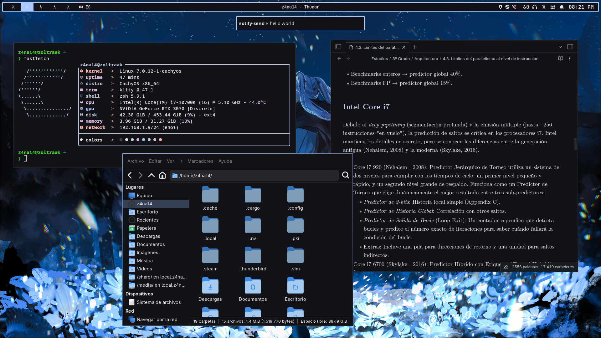

# z4na14's dotfiles

## Keybindings

| Keybinding | Action / Command |
| :--- | :--- |
| `SUPER + SPACE` | Switch to next keyboard layout |
| `SUPER + RETURN` | Launch Terminal (`kitty`) |
| `SUPER + Q` | Close active window |
| `SUPER + M` | Open Power menu script via `fuzzel` |
| `SUPER + L` | Lock screen (`hyprlock`) |
| `SUPER + E` | Launch File Manager (`thunar`) |
| `SUPER + F` | Toggle floating mode on active window |
| `SUPER + R` | Open Application Menu (`fuzzel`) |
| `CTRL + SHIFT + ESCAPE` | Launch System Monitor (`kitty btop`) |
| `SUPER + N` | Launch Wi-Fi / Network Manager (`kitty impala`) |
| `SUPER + P` | Change background (Select via `fuzzel` + `matugen`) |
| `SUPER + SHIFT + P` | Change background (Randomly via `/dev/random` + `matugen`) |
| `SUPER + S` | Screenshot: Select region to clipboard (`grim` + `slurp`) |
| `SUPER + SHIFT + S` | Screenshot: Select region to editor (`grim` + `slurp` + `swappy`) |
| `SUPER + PRINT` | Screenshot: Copy active window to clipboard (`grim`) |
| `PRINT` | Screenshot: Copy focused monitor to clipboard (`grim`) |
| `SUPER + V` | Open Clipboard History via `fuzzel` & `cliphist` |
| `SUPER + Left / Right / Up / Down` | Move window focus |
| `SUPER + Tab` | Cycle between floating windows |
| `SUPER + . (period)` | Fit current window to screen size (scrolling mode) |
| `SUPER + CTRL + Left` | Resize column (`-0.1`) |
| `SUPER + CTRL + Right` | Resize column (`+0.1`) |
| `SUPER + SHIFT + Left` | Swap column left |
| `SUPER + SHIFT + Right` | Swap column right |
| `SUPER + [1-5]` | Switch to Workspace 1 - 5 |
| `SUPER + SHIFT + [1-5]` | Move active window to Workspace 1 - 5 |
| `SUPER + H` | Toggle special workspace (Scratchpad / Magic) |
| `SUPER + SHIFT + H` | Move active window to special workspace |
| `SUPER + Left Mouse Button` | Drag window |
| `SUPER + Right Mouse Button` | Resize window |
| `XF86AudioRaiseVolume` | Raise audio volume (+5%) |
| `XF86AudioLowerVolume` | Lower audio volume (-5%) |
| `XF86AudioMute` | Toggle audio mute |
| `XF86AudioMicMute` | Toggle microphone mute |
| `XF86MonBrightnessUp` | Increase monitor brightness (+5%) |
| `XF86MonBrightnessDown` | Decrease monitor brightness (-5%) |
| `XF86AudioNext` | Media: Next track |
| `XF86AudioPause` | Media: Play / Pause |
| `XF86AudioPlay` | Media: Play / Pause |
| `XF86AudioPrev` | Media: Previous track |

## Prerequisites for apps

### Firefox / Thunderbird

README available inside `~/firefox`, but basically, stylesheets need to be enabled, and required files moved inside the respective folders.

### GTK

`THEME` folders must be installed as systemwide GTK theme, inside `/usr/share/themes`.

### Zed

Theme must be selected inside the config.

### Vesktop

https://github.com/refact0r/midnight-discord

Vesktop client must be installed.

https://github.com/Vencord/Vesktop

Custom client theme must be installed first, so CSS variables are applied correctly.

### Obsidian

Matugen config must point to the user vault.

### OBS

Theme must be selected in the config.

### Steam

https://github.com/kuska1/Material-Theme/

Millenium client must be installed.

https://github.com/SteamClientHomebrew/Millennium

Custom client theme must be installed first, so CSS variables are applied correctly. Also, Color scheme shall be selected in the theme config.
