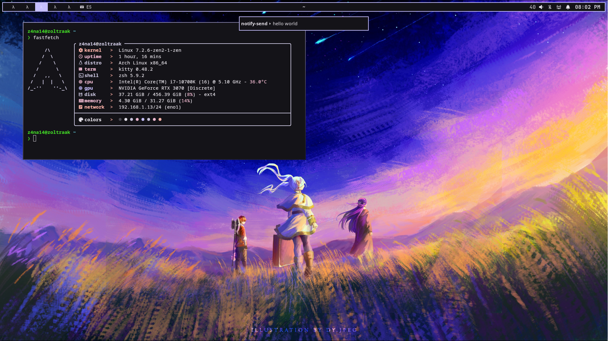

# z4na14's dotfiles

## Keybindings

| Keybinding | Action / Command |
| :--- | :--- |
| `SUPER + SPACE` | Switch to next keyboard layout |
| `SUPER + RETURN` | Launch Terminal (`kitty`) |
| `SUPER + Q` | Close active window |
| `SUPER + M` | Open Power menu script via `fuzzel` |
| `SUPER + L` | Lock screen (`hyprlock`) |
| `SUPER + E` | Launch File Manager (`thunar`) |
| `SUPER + F` | Toggle floating mode on active window |
| `SUPER + R` | Open Application Menu (`fuzzel`) |
| `CTRL + SHIFT + ESCAPE` | Launch System Monitor (`kitty btop`) |
| `SUPER + N` | Launch Wi-Fi / Network Manager (`kitty impala`) |
| `SUPER + P` | Change background (Select via `fuzzel` + `matugen`) |
| `SUPER + SHIFT + P` | Change background (Randomly via `/dev/random` + `matugen`) |
| `SUPER + S` | Screenshot: Select region to clipboard (`grim` + `slurp`) |
| `SUPER + SHIFT + S` | Screenshot: Select region to editor (`grim` + `slurp` + `swappy`) |
| `SUPER + PRINT` | Screenshot: Copy active window to clipboard (`grim`) |
| `PRINT` | Screenshot: Copy focused monitor to clipboard (`grim`) |
| `SUPER + V` | Open Clipboard History via `fuzzel` & `cliphist` |
| `SUPER + Left / Right / Up / Down` | Move window focus |
| `SUPER + Tab` | Cycle between floating windows |
| `SUPER + . (period)` | Fit current window to screen size (scrolling mode) |
| `SUPER + CTRL + Left` | Resize column (`-0.1`) |
| `SUPER + CTRL + Right` | Resize column (`+0.1`) |
| `SUPER + SHIFT + Left` | Swap column left |
| `SUPER + SHIFT + Right` | Swap column right |
| `SUPER + [1-5]` | Switch to Workspace 1 - 5 |
| `SUPER + SHIFT + [1-5]` | Move active window to Workspace 1 - 5 |
| `SUPER + H` | Toggle special workspace (Scratchpad / Magic) |
| `SUPER + SHIFT + H` | Move active window to special workspace |
| `SUPER + Left Mouse Button` | Drag window |
| `SUPER + Right Mouse Button` | Resize window |
| `XF86AudioRaiseVolume` | Raise audio volume (+5%) |
| `XF86AudioLowerVolume` | Lower audio volume (-5%) |
| `XF86AudioMute` | Toggle audio mute |
| `XF86AudioMicMute` | Toggle microphone mute |
| `XF86MonBrightnessUp` | Increase monitor brightness (+5%) |
| `XF86MonBrightnessDown` | Decrease monitor brightness (-5%) |
| `XF86AudioNext` | Media: Next track |
| `XF86AudioPause` | Media: Play / Pause |
| `XF86AudioPlay` | Media: Play / Pause |
| `XF86AudioPrev` | Media: Previous track |

### Dev keybindings

| Category | Key | Action |
|---|---|---|
| tmux — Splits | `Ctrl+a e` | Split pane down (horizontal line) |
| tmux — Splits | `Ctrl+a r` | Split pane right (vertical line) |
| tmux — Splits | `Ctrl+a x` | Close current pane |
| tmux — Pane Navigation | `Ctrl+a ←/→/↑/↓` | Move between panes |
| tmux — Pane Navigation | `Ctrl+a q` | Show pane numbers (then press number to jump) |
| tmux — Pane Navigation | `Ctrl+a z` | Zoom/unzoom current pane (fullscreen toggle) |
| tmux — Pane Navigation | `Ctrl+a {` / `Ctrl+a }` | Swap pane left/right |
| tmux — Windows | `Ctrl+a c` | Create new window |
| tmux — Windows | `Ctrl+a n` / `Ctrl+a p` | Next / previous window |
| tmux — Windows | `Ctrl+a 1-9` | Jump to window by number |
| tmux — Windows | `Ctrl+a ,` | Rename current window |
| tmux — Windows | `Ctrl+a &` | Close current window |
| tmux — Sessions | `Ctrl+a d` | Detach from session |
| tmux — Sessions | `Ctrl+a s` | List/switch sessions |
| tmux — Copy Mode | `Ctrl+a [` | Enter copy/scroll mode |
| tmux — Copy Mode | `q` | Exit copy mode |
| tmux — Mouse | *(enabled)* | Click to select pane, drag to resize, scroll for copy mode |
| nvim — Window Navigation | `Ctrl+w h/j/k/l` | Move between splits |
| nvim — Window Navigation | `Ctrl+w v` | Vertical split |
| nvim — Window Navigation | `Ctrl+w s` | Horizontal split |
| nvim — Window Navigation | `Ctrl+w q` | Close current split |
| nvim — Window Navigation | `Ctrl+w =` | Equalize split sizes |
| nvim — Window Resize | `Ctrl+w +` | Increase height |
| nvim — Window Resize | `Ctrl+w -` | Decrease height |
| nvim — Window Resize | `Ctrl+w >` | Increase width |
| nvim — Window Resize | `Ctrl+w <` | Decrease width |
| nvim — Window Resize | `Ctrl+w _` | Maximize height |
| nvim — Window Resize | `Ctrl+w \|` | Maximize width |
| nvim — Folding | `za` | Toggle fold under cursor |
| nvim — Folding | `zo` / `zc` | Open / close fold |
| nvim — Folding | `zR` | Open all folds |
| nvim — Folding | `zM` | Close all folds |
| nvim — Folding | `zj` / `zk` | Jump to next/previous fold |
| nvim — Buffers | `:bnext` / `:bprev` | Next / previous buffer |
| nvim — Buffers | `<leader>fb` | Fuzzy-find buffers (Telescope) |
| nvim — Files | `<leader>ff` | Find files (Telescope) |
| nvim — Files | `<leader>fg` | Live grep (Telescope) |
| nvim — Files | `<leader>fh` | Search help tags (Telescope) |
| nvim — Files | `:Oil` | Open file explorer (oil.nvim) |
| nvim — Files | `-` | Go to parent directory (oil.nvim) |
| nvim — Git (gitsigns) | `<leader>gp` | Preview hunk diff |
| nvim — Git (gitsigns) | `<leader>gi` | Toggle inline hunk diff |
| nvim — Git (gitsigns) | `<leader>gr` | Reset/restore hunk (normal + visual) |
| nvim — LSP | `<leader>ld` | Go to Definition |
| nvim — LSP | `<leader>lD` | Go to Declaration |
| nvim — LSP | `<leader>lr` | Find References |
| nvim — LSP | `<leader>li` | Go to Implementation |
| nvim — LSP | `<leader>lw` | Hover Documentation |
| nvim — LSP | `<leader>rn` | Rename Symbol |
| nvim — LSP | `<leader>ca` | Code Action |
| nvim — Diagnostics | `<leader>de` | Show diagnostic under cursor |
| nvim — Diagnostics | `<leader>dj` | Jump to next diagnostic |
| nvim — Diagnostics | `<leader>dk` | Jump to previous diagnostic |
| nvim — Diagnostics | `<leader>dq` | Diagnostics to location list |
| nvim — Insert Mode Extras | `lk` | Exit to Normal mode |
| nvim — Insert Mode Extras | `Ctrl+z` / `Ctrl+Shift+z` | Undo / Redo without leaving Insert |
| nvim — Insert Mode Extras | `Ctrl+Left/Right` | Jump word backward/forward |
| nvim — Insert Mode Extras | `Ctrl+Backspace` | Delete word backward |

## Prerequisites for apps

### Firefox / Thunderbird

README available inside `~/firefox`, but basically, stylesheets need to be enabled, and required files moved inside the respective folders.

### GTK

`THEME` folders must be installed as systemwide GTK theme, inside `/usr/share/themes`.

### Zed

Theme must be selected inside the config.

### Vesktop

https://github.com/refact0r/midnight-discord

Vesktop client must be installed.

https://github.com/Vencord/Vesktop

Custom client theme must be installed first, so CSS variables are applied correctly.

### Obsidian

Matugen config must point to the user vault.

### OBS

Theme must be selected in the config.

### Steam

https://github.com/kuska1/Material-Theme/

Millenium client must be installed.

https://github.com/SteamClientHomebrew/Millennium

Custom client theme must be installed first, so CSS variables are applied correctly. Also, Color scheme shall be selected in the theme config.
